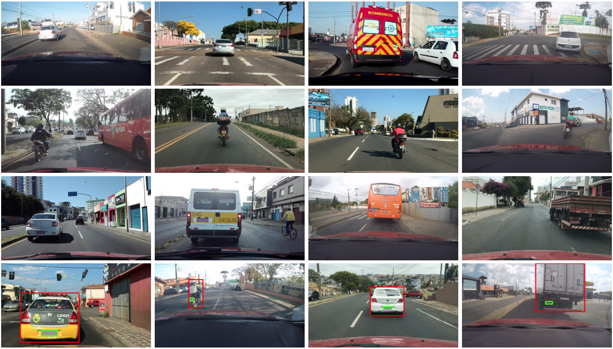

# UFPR-ALPR Dataset ([Website](https://web.inf.ufpr.br/vri/databases/ufpr-alpr/))

This dataset, called UFPR-ALPR dataset, includes 4,500 fully annotated images (over 30,000 LP characters) from 150 vehicles in real-world scenarios where both the vehicle and the camera (inside another vehicle) are moving. It has been introduced in our IJCNN paper [[PDF]](./pdfs/laroca2018robust.pdf).

The images were acquired with three different cameras and are available in the Portable Network Graphics (PNG) format with a size of 1,920 × 1,080 pixels. The cameras used were: GoPro Hero4 Silver, Huawei P9 Lite, and iPhone 7 Plus.

We collected 1,500 images with each camera, divided as follows:

* 900 of cars with gray LP;
* 300 of cars with red LP;
* 300 of motorcycles with gray LP.

The dataset is split as follows: 40% for training, 40% for testing and 20% for validation. Every image has the following annotations available in a text file: the camera in which the image was taken, the vehicle’s position and information such as type (car or motorcycle), manufacturer, model and year; the identification and position of the LP, as well as the position of its characters. The full details are in our [paper](./pdfs/laroca2018robust.pdf).


Here are some examples from the dataset:  


## How to obtain the Dataset

The UFPR-ALPR dataset is released for academic research only and is free to researchers from educational or research institutes for **non-commercial purposes**.

Please click [**here**](./license-agreement.md) for more info about obtaining the dataset.

You can now check who is downloading our dataset (see [here](https://raysonlaroca.github.io/misc/ufpr-alpr-map/index.html)).

## Citation

If you use the UFPR-ALPR dataset in your research, please cite our paper:

* R. Laroca, E. Severo, L. A. Zanlorensi, L. S. Oliveira, G. R. Gonçalves, W. R. Schwartz, and D. Menotti, “*A Robust Real-Time Automatic License Plate Recognition Based on the YOLO Detector*” in International Joint Conference on Neural Networks (IJCNN), July 2018, pp. 1–10. [[IEEE Xplore]](https://www.doi.org/10.1109/IJCNN.2018.8489629) [[arXiv]](https://arxiv.org/abs/1802.09567)

```
@inproceedings{laroca2018robust,
  title = {A Robust Real-Time Automatic License Plate Recognition Based on the {YOLO} Detector},
  author = {R. {Laroca} and E. {Severo} and L. A. {Zanlorensi} and L. S. {Oliveira} and G. R. {Gon{\c{c}}alves} and W. R. {Schwartz} and D. {Menotti}},
  year = {2018},
  month = {July},
  booktitle = {International Joint Conference on Neural Networks (IJCNN)},
  volume = {},
  number = {},
  pages = {1-10},
  doi = {10.1109/IJCNN.2018.8489629},
  issn = {2161-4407}
}
```

You may also be interested in our [**new research**](./pdfs/laroca2021efficient.pdf), where we considerably improved our ALPR system and provided labels for many images from public datasets:

* R. Laroca, L. A. Zanlorensi, G. R. Gonçalves, E. Todt, W. R. Schwartz, D. Menotti, “*An Efficient and Layout-Independent Automatic License Plate Recognition System Based on the YOLO Detector*,” IET Intelligent Transport Systems, vol. 15, no. 4, pp. 483-503, 2021. [[Wiley]](https://doi.org/10.1049/itr2.12030) [[arXiv]](https://arxiv.org/abs/1909.01754)

Additionally, consider showing your support by starring this repository.

## Additional Results

To enable comparisons with approaches designed specifically for cars (i.e., approaches that do not work for motorcycles), here we separately report the recognition rates obtained on images of cars and motorcycles (see table below). All authors who downloaded the dataset were notified of this update on August 2, 2019.

|        ALPR System       |  Cars | Motorcycles | Cars + Motorcycles |
|:------------------------:|:-----:|:-----------:|:------------------:|
|     Sighthound (2018)    | 58.4% |     3.3%    |        47.4%       |
|      OpenALPR (2018)     | 58.0% |    22.8%    |        50.9%       |
|      [Laroca et al. (2018)](./pdfs/laroca2018robust.pdf)     | 72.2% |    35.6%    |        64.9%       |
| [Laroca et al. (2021)](./pdfs/laroca2021efficient.pdf) | 95.9% |    66.3%    |        90.0%       |

| ALPR System (with redundancy) |  Cars | Motorcycles | Cars + Motorcycles |
|:-----------------------------:|:-----:|:-----------:|:------------------:|
|       Sighthound (2018)       | 70.8% |     0.0%    |        56.7%       |
|        OpenALPR (2018)        | 89.6% |     0.0%    |        71.7%       |
|        [Laroca et al. (2018)](./pdfs/laroca2018robust.pdf)        | 83.3% |    58.3%    |        78.3%       |
|    [Laroca et al. (2021)](./pdfs/laroca2021efficient.pdf)   | 98.3% |    70.0%    |        92.7%       |

## Related publications

A list of all our papers on ALPR can be seen [here](https://scholar.google.com/scholar?hl=pt-BR&as_sdt=0%2C5&as_ylo=2018&q=allintitle%3A+plate+OR+license+OR+vehicle+author%3A%22Rayson+Laroca%22&btnG=).

## Contact

Please contact Rayson Laroca ([rblsantos@inf.ufpr.br](mailto:rblsantos@inf.ufpr.br)) with questions or comments.
